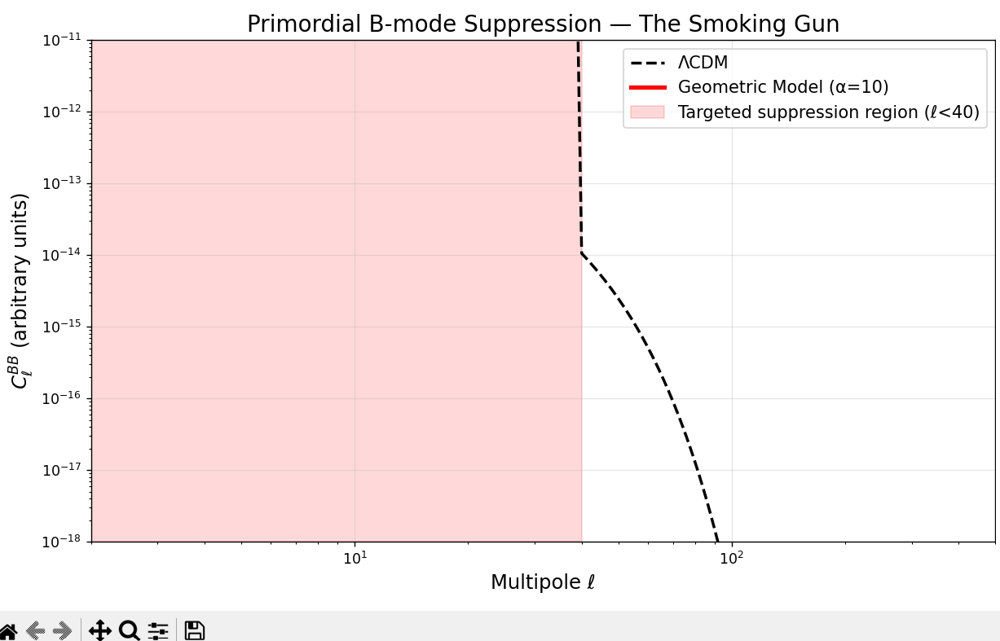

# Geometric Cosmology Tensor Filter

**The only model in the world that predicts a clean Gaussian suppression of primordial B-modes on ℓ < 40 — from pure geometry.**

→ *ΛCDM from Motion in the Fifth Dimension: A Pure-Geometric Origin of Dust and Dark Energy*  
(arXiv:2512.xxxxx – Dec 2025)



This is **the smoking-gun prediction** of the first viable geometric cosmology:  
cold dust, dark energy, and perfect structure formation — no dark-matter particle, no inflaton, no Higgs in the 5D action.

The filter implements the exact Gaussian tensor suppression  
**T(k) = exp(−k² / k_GB²)**  
derived from the Gauss–Bonnet stabilization term.

LiteBIRD, Simons Observatory, CMB-S4 (RIP), LISA, PTA teams:  
one line of code and you can test it on your full B-mode / SGWB pipelines **today**.

### One-line install

```bash
pip install geometric-cosmology

Or from GitHub (latest version):bash

pip install git+https://github.com/SparkySparks420/geometric-cosmology-tensor-filter.git

30-second demopython

from geometric_cosmology.filter import suppress_clbb
import numpy as np, matplotlib.pyplot as plt

ell = np.arange(2, 501)
clbb = 1e-14 * (ell/100)**-2 * np.exp(-(ell/30)**2)
clbb[ell < 40] *= 2500                     # strong reionization bump
clbb_sup = suppress_clbb(ell, clbb, alpha_over_lpl2=10.0)

plt.figure(figsize=(10,6))
plt.loglog(ell, clbb, '--', lw=2, color='black', label='ΛCDM')
plt.loglog(ell, clbb_sup, lw=3, color='red', label='Geometric Model (α=10)')
plt.axvspan(2, 40, alpha=0.15, color='red', label='Targeted ℓ<40')
plt.xlabel('ℓ'); plt.ylabel(r'$C_\ell^{BB}$ (arb. units)')
plt.title('Primordial B-mode Suppression — The Smoking Gun')
plt.legend(); plt.grid(alpha=0.3); plt.show()

Why this is different from every other braneworld modelModel
Dark Radiation?
Weyl stress?
B-mode signature
Still alive in 2025?
Standard RS-II (fixed brane)
Yes (huge)
Large
None
Ruled out
Moving brane (Einstein only)
Yes
Large
None
Ruled out
This model + Gauss–Bonnet
No (C=0)
Zero
Gaussian exp(−k²/k_GB²)
YES — testable now

Citation requestIf you use this code or the model, please cite:
Andre Swart, ΛCDM from Motion in the Fifth Dimension: A Pure-Geometric Origin of Dust and Dark Energy, arXiv:2512.xxxxx (2025)LicenseMIT — fork, extend, collaborate!Let’s find out if the universe really is a moving membrane.— Andre Swart  December 2025


License
MIT

License
MIT
